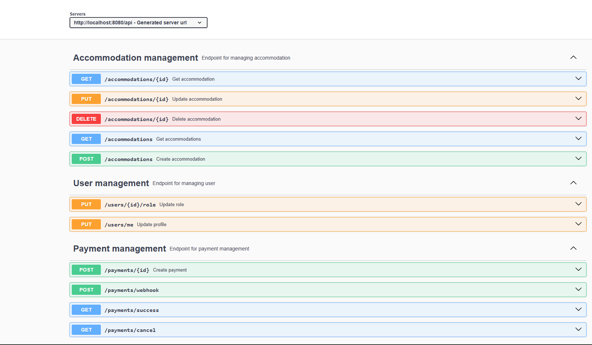
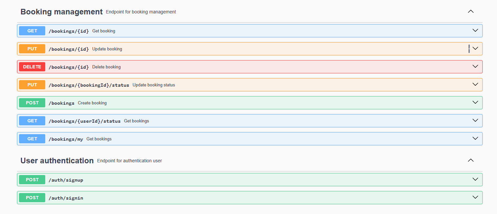

# 🏡 Booking System — Accommodation Reservation App
## 🔹 Introduction
This project was both an interesting and valuable experience for me.

The idea came after my recent vacation, where I had to book accommodations through a third-party platform. I thought:

“Why not create something like this myself?”

The system includes:

👤 User registration

🏠 Accommodation listing

📅 Booking

💳 Online payments

🔄 Status management

🔹 Technologies Used
☕ Java 17

🚀 Spring Boot (Core framework)

🔐 Spring Security + JWT (authentication/authorization)

🌐 Spring Web (REST API)

🗄 Spring Data JPA + Hibernate

🔄 Liquibase (DB migrations)

📦 Docker (containerization)

💳 Stripe API (payments)

🤖 Telegram Bot API (notifications)

🌍 Ngrok (webhook tunneling)

🔄 MapStruct (DTO ↔ Entity mapping)

🧪 JUnit & Integration Tests

## 🔹 Main Functionalities
ℹ️ Base path: /api

1. 🔐 AuthController

POST /register — Register new user

POST /login — User login

2. 👤 UserController

PUT /update-role — Update user role

PUT /update-profile — Edit profile

3. 🏠 AccommodationController

POST /accommodation — Create accommodation

GET /accommodations — View all listings

GET /accommodation/{id} — View accommodation by ID

PUT /accommodation/{id} — Update listing

DELETE /accommodation/{id} — Delete listing

4. 📅 BookingController

POST /booking — Create a booking

GET /bookings — View bookings by status

GET /bookings/me — View current user's bookings

GET /booking/{id} — View specific booking

PUT /booking/{id} — Update booking

PUT /booking/status/{id} — Change booking status

DELETE /booking/{id} — Cancel booking

5. 💳 PaymentController

POST /payment — Create payment via Stripe

Stripe webhook — Automatically updates status after successful payment

## 🔹 How to Run the Project
⚠ Required tools:

Docker

Java 17

MySQL (or container)

Ngrok account (for Stripe webhook)

🔧 Steps:

bash
# 1. Clone the repository
git clone https://github.com/romander333/booking_accommodation.git
cd booking_accommodation

# 2. Configure .env or application.yml (Stripe keys, DB config, etc.)

# 3. Run Docker components
docker-compose up

# 4. (Optional) Start Ngrok tunnel
ngrok http 8080
📌 Architecture diagrams:

## 🔹 Key Features & Challenges
✅ Integrated Stripe API with webhook support (first-time experience)

✅ Built custom JWT-based authentication

✅ Used MapStruct for DTO ↔ Entity mapping

✅ Role management (admin/user) and secure profile updates

✅ Telegram bot sends notifications about new bookings to admin (asynchronously using Executor)

## 🔹 Swagger
📄 Interactive API documentation:
http://localhost:8080/api/swagger-ui/index.html

## 🔹 Author
Roman Luchko
📱 Telegram: @servetochka
💻 GitHub: romander333
